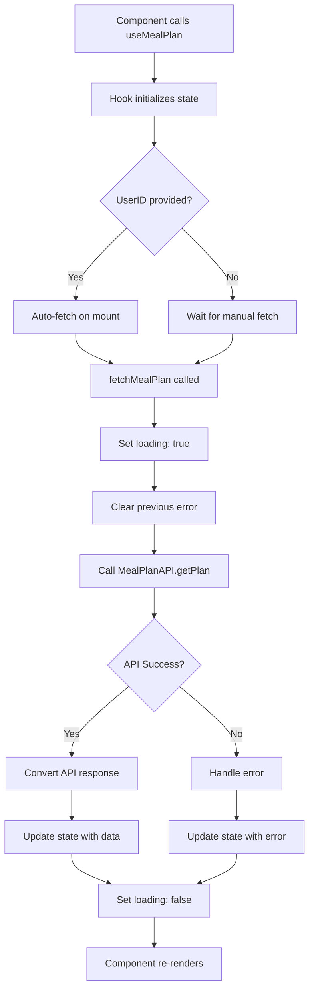

# 🎣 React Hooks Documentation

This document provides comprehensive documentation for all custom React hooks in the Nutri2Go application.

## 🏗️ Hook Architecture

All hooks follow React best practices with TypeScript integration, proper dependency management, and comprehensive error handling.

---

## 🍽️ useMealPlan Hook

**Location**: `src/hooks/useMealPlan.ts`

A comprehensive custom hook for managing meal plan data with API integration, loading states, and error handling.

### Hook Signature

```typescript
export const useMealPlan = (userID?: string): UseMealPlanReturn
```

### Interface Definitions

```typescript
interface UseMealPlanState {
  data: GetPlanResponse | null;                                    // Raw API response data
  formattedData: ReturnType<typeof MealPlanAPI.convertGetPlanResponse> | null; // Formatted frontend data
  loading: boolean;                                                // Loading state indicator
  error: string | null;                                           // Error message (null if no error)
}

interface UseMealPlanReturn extends UseMealPlanState {
  fetchMealPlan: (userID: string) => Promise<void>;              // Fetch meal plan function
  refetch: () => Promise<void>;                                  // Refetch with last userID
  clearError: () => void;                                        // Clear error state
}
```

### Features

- ✅ **Automatic Data Fetching**: Optional userID parameter for auto-fetch on mount
- ✅ **Dual Data Format**: Provides both raw API data and formatted frontend data
- ✅ **Loading States**: Built-in loading state management
- ✅ **Error Handling**: Comprehensive error catching and user-friendly messages
- ✅ **Refetch Capability**: Easy data refresh functionality
- ✅ **Type Safety**: Full TypeScript integration throughout

### State Management

```typescript
const [state, setState] = useState<UseMealPlanState>({
  data: null,               // No initial data
  formattedData: null,      // No initial formatted data
  loading: false,           // Not loading initially
  error: null,              // No initial error
});

const [currentUserID, setCurrentUserID] = useState<string | undefined>(userID);
```

### Core Functions

#### fetchMealPlan Function

```typescript
const fetchMealPlan = useCallback(async (id: string) => {
  setState(prev => ({ ...prev, loading: true, error: null }));
  
  try {
    const response = await MealPlanAPI.getPlan(id);
    const formatted = MealPlanAPI.convertGetPlanResponse(response);
    
    setState(prev => ({
      ...prev,
      data: response,
      formattedData: formatted,
      loading: false,
    }));
    
    setCurrentUserID(id);
  } catch (error: any) {
    let errorMessage = 'Failed to fetch meal plan';
    
    if (error instanceof APIError) {
      switch (error.statusCode) {
        case 404:
          errorMessage = 'Meal plan not found for this user';
          break;
        case 500:
          errorMessage = 'Server error. Please try again later';
          break;
        case 0:
          errorMessage = 'Network error. Check your connection';
          break;
        default:
          errorMessage = error.message;
      }
    }
    
    setState(prev => ({
      ...prev,
      loading: false,
      error: errorMessage
    }));
  }
}, []);
```

#### refetch Function

```typescript
const refetch = useCallback(async () => {
  if (currentUserID) {
    await fetchMealPlan(currentUserID);
  }
}, [currentUserID, fetchMealPlan]);
```

#### clearError Function

```typescript
const clearError = useCallback(() => {
  setState(prev => ({ ...prev, error: null }));
}, []);
```

### Usage Examples

#### Basic Usage

```typescript
const HomeScreen: React.FC = () => {
  const { formattedData, loading, error, fetchMealPlan } = useMealPlan();
  
  useEffect(() => {
    const userID = 'user123';
    fetchMealPlan(userID);
  }, [fetchMealPlan]);
  
  if (loading) {
    return (
      <View style={styles.loadingContainer}>
        <ActivityIndicator size="large" color="#007AFF" />
        <Text>Loading your meal plan...</Text>
      </View>
    );
  }
  
  if (error) {
    return (
      <View style={styles.errorContainer}>
        <Text style={styles.errorText}>{error}</Text>
        <CustomButton 
          title="Retry" 
          onPress={() => fetchMealPlan('user123')} 
        />
      </View>
    );
  }
  
  return (
    <ScrollView>
      {formattedData && (
        <>
          <MealCard meal={formattedData.morning} />
          <MealCard meal={formattedData.afternoon} />
          <MealCard meal={formattedData.dinner} />
          {formattedData.alternatives.map((meal, index) => (
            <MealCard key={index} meal={meal} />
          ))}
        </>
      )}
    </ScrollView>
  );
};
```

#### Auto-fetch on Mount

```typescript
const MealPlanScreen: React.FC = () => {
  const { userData } = useAuth();
  
  // Generate userID from user data
  const userID = userData 
    ? `${userData.firstName}_${userData.lastName}_${userData.age}`.toLowerCase()
    : undefined;
  
  // Auto-fetch when userID is available
  const { formattedData, loading, error, refetch } = useMealPlan(userID);
  
  return (
    <View>
      {loading && <LoadingSpinner />}
      {error && <ErrorMessage error={error} onRetry={refetch} />}
      {formattedData && <MealPlanDisplay data={formattedData} />}
    </View>
  );
};
```

#### With Error Handling

```typescript
const MealPlanWidget: React.FC = () => {
  const { 
    formattedData, 
    loading, 
    error, 
    fetchMealPlan, 
    clearError 
  } = useMealPlan();
  
  const handleFetchMealPlan = async () => {
    try {
      clearError(); // Clear any existing errors
      await fetchMealPlan('user123');
    } catch (err) {
      // Error is already handled by the hook
      console.log('Fetch failed, but handled by hook');
    }
  };
  
  return (
    <View>
      <CustomButton 
        title="Load Meal Plan" 
        onPress={handleFetchMealPlan}
        loading={loading}
      />
      
      {error && (
        <View style={styles.errorBanner}>
          <Text style={styles.errorText}>{error}</Text>
          <TouchableOpacity onPress={clearError}>
            <Text style={styles.dismissText}>Dismiss</Text>
          </TouchableOpacity>
        </View>
      )}
      
      {formattedData && (
        <MealPlanView data={formattedData} />
      )}
    </View>
  );
};
```

### Data Flow



### Error Handling Strategy

The hook provides comprehensive error handling with user-friendly messages:

```typescript
const getErrorMessage = (error: any): string => {
  if (error instanceof APIError) {
    switch (error.statusCode) {
      case 400:
        return 'Invalid user information. Please check your profile.';
      case 401:
        return 'Please log in again to access meal plans.';
      case 403:
        return 'You do not have permission to access meal plans.';
      case 404:
        return 'No meal plan found for your profile. Please try again.';
      case 429:
        return 'Too many requests. Please wait a moment and try again.';
      case 500:
      case 502:
      case 503:
        return 'Server is temporarily unavailable. Please try again later.';
      case 0:
        return 'Network connection error. Please check your internet connection.';
      default:
        return error.message || 'An unexpected error occurred.';
    }
  }
  
  return 'Failed to load meal plan. Please try again.';
};
```

### Performance Considerations

#### Memoization

```typescript
const fetchMealPlan = useCallback(async (id: string) => {
  // Function implementation
}, []); // Empty dependency array as function doesn't depend on external values

const refetch = useCallback(async () => {
  if (currentUserID) {
    await fetchMealPlan(currentUserID);
  }
}, [currentUserID, fetchMealPlan]); // Proper dependencies
```

#### State Updates

```typescript
// Functional updates to prevent stale closures
setState(prev => ({
  ...prev,
  loading: true,
  error: null
}));

// Batch state updates for better performance
setState(prev => ({
  ...prev,
  data: response,
  formattedData: formatted,
  loading: false,
}));
```

### Integration with React DevTools

The hook provides meaningful state names for debugging:

```typescript
// State will show in React DevTools as:
{
  data: GetPlanResponse | null,
  formattedData: FormattedMealPlan | null,
  loading: boolean,
  error: string | null
}
```

---

## 🔄 useAuth Hook

**Location**: `src/navigation/AppNavigator.tsx`

Authentication hook provided by the AuthContext for managing user authentication state.

### Hook Signature

```typescript
export const useAuth = (): AuthContextType
```

### Available Properties and Methods

```typescript
const {
  isLoggedIn,              // boolean - Current login state
  setIsLoggedIn,           // (loggedIn: boolean) => void
  hasCompletedOnboarding,  // boolean - Onboarding completion state
  setHasCompletedOnboarding, // (completed: boolean) => void
  userEmail,               // string | undefined - User email
  setUserEmail,            // (email: string) => void
  userData,                // User | undefined - Complete user profile
  setUserData,             // (data: User) => void
  login,                   // () => void - Login function
  logout,                  // () => void - Logout function
  completeOnboarding       // (userData: User) => void - Complete onboarding
} = useAuth();
```

### Usage Examples

#### Basic Authentication Check

```typescript
const ProtectedScreen: React.FC = () => {
  const { isLoggedIn, userData } = useAuth();
  
  if (!isLoggedIn) {
    return <LoginPrompt />;
  }
  
  return (
    <View>
      <Text>Welcome, {userData?.firstName}!</Text>
    </View>
  );
};
```

#### Login Flow

```typescript
const LoginScreen: React.FC = () => {
  const { login, setUserEmail } = useAuth();
  const [email, setEmail] = useState('');
  const [password, setPassword] = useState('');
  
  const handleLogin = async () => {
    try {
      // Validate credentials with API
      const response = await authenticateUser(email, password);
      
      if (response.success) {
        setUserEmail(email);
        login(); // Updates context state
        // Navigation handled automatically by context state change
      }
    } catch (error) {
      console.error('Login failed:', error);
    }
  };
  
  return (
    <View>
      <CustomInput 
        value={email}
        onChangeText={setEmail}
        placeholder="Email"
      />
      <CustomInput 
        value={password}
        onChangeText={setPassword}
        placeholder="Password"
        secureTextEntry
      />
      <CustomButton 
        title="Login"
        onPress={handleLogin}
      />
    </View>
  );
};
```

#### Onboarding Completion

```typescript
const UserInfoGoalsScreen: React.FC = () => {
  const { completeOnboarding } = useAuth();
  const [userGoal, setUserGoal] = useState('');
  
  const handleComplete = () => {
    const completeUserData: User = {
      firstName: 'John',
      lastName: 'Doe',
      age: 28,
      weight: 75,
      height: 180,
      unit: 'metric',
      goal: userGoal
    };
    
    completeOnboarding(completeUserData);
    // Navigation to main app handled automatically
  };
  
  return (
    <View>
      <GoalSelector 
        value={userGoal}
        onChange={setUserGoal}
      />
      <CustomButton 
        title="Complete Setup"
        onPress={handleComplete}
      />
    </View>
  );
};
```

---

## 🎯 Custom Hook Best Practices

### 1. Hook Structure Template

```typescript
// src/hooks/useCustomHook.ts
import { useState, useEffect, useCallback } from 'react';
import { CustomHookParams, CustomHookReturn } from '../types';

export const useCustomHook = (params?: CustomHookParams): CustomHookReturn => {
  // 1. State declarations
  const [state, setState] = useState(initialState);
  
  // 2. Memoized callbacks
  const memoizedFunction = useCallback(() => {
    // Function implementation
  }, [dependencies]);
  
  // 3. Effects
  useEffect(() => {
    // Effect implementation
    return () => {
      // Cleanup
    };
  }, [dependencies]);
  
  // 4. Return object
  return {
    // State
    ...state,
    // Functions
    memoizedFunction,
  };
};
```

### 2. Error Handling Pattern

```typescript
const useAPIData = <T>(endpoint: string) => {
  const [data, setData] = useState<T | null>(null);
  const [loading, setLoading] = useState(false);
  const [error, setError] = useState<string | null>(null);
  
  const fetchData = useCallback(async () => {
    try {
      setLoading(true);
      setError(null);
      
      const response = await apiRequest<T>(endpoint);
      setData(response);
    } catch (err: any) {
      setError(err.message || 'An error occurred');
      setData(null);
    } finally {
      setLoading(false);
    }
  }, [endpoint]);
  
  return { data, loading, error, fetchData, retry: fetchData };
};
```

### 3. Cleanup Pattern

```typescript
const useWebSocket = (url: string) => {
  const [socket, setSocket] = useState<WebSocket | null>(null);
  const [messages, setMessages] = useState<string[]>([]);
  
  useEffect(() => {
    const ws = new WebSocket(url);
    
    ws.onmessage = (event) => {
      setMessages(prev => [...prev, event.data]);
    };
    
    setSocket(ws);
    
    // Cleanup function
    return () => {
      ws.close();
      setSocket(null);
    };
  }, [url]);
  
  const sendMessage = useCallback((message: string) => {
    if (socket?.readyState === WebSocket.OPEN) {
      socket.send(message);
    }
  }, [socket]);
  
  return { messages, sendMessage };
};
```

### 4. Dependency Management

```typescript
const useDebouncedValue = <T>(value: T, delay: number): T => {
  const [debouncedValue, setDebouncedValue] = useState<T>(value);
  
  useEffect(() => {
    const handler = setTimeout(() => {
      setDebouncedValue(value);
    }, delay);
    
    return () => {
      clearTimeout(handler);
    };
  }, [value, delay]); // Proper dependencies
  
  return debouncedValue;
};
```

---

## 🧪 Testing Custom Hooks

### Hook Testing Pattern

```typescript
// src/hooks/__tests__/useMealPlan.test.ts
import { renderHook, act } from '@testing-library/react-hooks';
import { useMealPlan } from '../useMealPlan';
import * as MealPlanAPI from '../../services/mealPlanAPI';

// Mock the API
jest.mock('../../services/mealPlanAPI');
const mockedAPI = MealPlanAPI as jest.Mocked<typeof MealPlanAPI>;

describe('useMealPlan Hook', () => {
  beforeEach(() => {
    jest.clearAllMocks();
  });
  
  test('should initialize with correct default state', () => {
    const { result } = renderHook(() => useMealPlan());
    
    expect(result.current.data).toBeNull();
    expect(result.current.formattedData).toBeNull();
    expect(result.current.loading).toBe(false);
    expect(result.current.error).toBeNull();
  });
  
  test('should fetch meal plan successfully', async () => {
    const mockResponse = {
      morn: { Name: 'Breakfast', Restaurant: 'Cafe', Calorie: 300 },
      afternoon: { Name: 'Lunch', Restaurant: 'Bistro', Calorie: 500 },
      dinner: { Name: 'Dinner', Restaurant: 'Restaurant', Calorie: 600 },
      Alt: []
    };
    
    mockedAPI.MealPlanAPI.getPlan.mockResolvedValueOnce(mockResponse);
    mockedAPI.MealPlanAPI.convertGetPlanResponse.mockReturnValueOnce({
      morning: { id: 1, name: 'Breakfast', restaurant: 'Cafe', calories: 300 },
      afternoon: { id: 2, name: 'Lunch', restaurant: 'Bistro', calories: 500 },
      dinner: { id: 3, name: 'Dinner', restaurant: 'Restaurant', calories: 600 },
      alternatives: []
    });
    
    const { result } = renderHook(() => useMealPlan());
    
    await act(async () => {
      await result.current.fetchMealPlan('user123');
    });
    
    expect(result.current.loading).toBe(false);
    expect(result.current.error).toBeNull();
    expect(result.current.data).toEqual(mockResponse);
    expect(result.current.formattedData).toBeDefined();
  });
  
  test('should handle API errors gracefully', async () => {
    const mockError = new Error('API Error');
    mockedAPI.MealPlanAPI.getPlan.mockRejectedValueOnce(mockError);
    
    const { result } = renderHook(() => useMealPlan());
    
    await act(async () => {
      await result.current.fetchMealPlan('user123');
    });
    
    expect(result.current.loading).toBe(false);
    expect(result.current.error).toBe('Failed to fetch meal plan');
    expect(result.current.data).toBeNull();
  });
});
```

---

## 📋 Hook Development Checklist

### Before Creating a New Hook

- [ ] **Single Responsibility**: Hook has one clear purpose
- [ ] **Reusability**: Can be used across multiple components
- [ ] **TypeScript**: Full type safety with proper interfaces
- [ ] **Error Handling**: Comprehensive error catching and messaging
- [ ] **Performance**: Proper use of useMemo, useCallback, and dependency arrays
- [ ] **Testing**: Unit tests covering success and error cases
- [ ] **Documentation**: Clear JSDoc comments and usage examples

### Hook Quality Checklist

- [ ] **State Management**: Proper state initialization and updates
- [ ] **Side Effects**: Appropriate cleanup in useEffect
- [ ] **Dependencies**: Correct dependency arrays
- [ ] **Memory Leaks**: No subscriptions or timers without cleanup
- [ ] **Error Boundaries**: Doesn't crash the component tree
- [ ] **Loading States**: Appropriate loading indicators
- [ ] **Type Safety**: No usage of `any` type

This comprehensive hook documentation ensures proper usage and maintenance of all custom hooks in the Nutri2Go application! 🚀